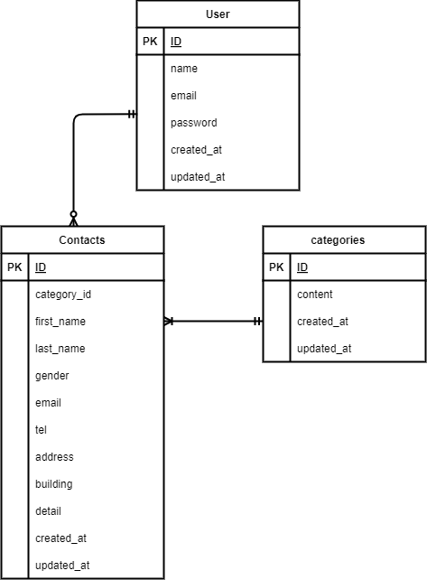

# laravel アプリケーション
確認テスト お問い合わせフォーム

## 環境構築


### 作成手順
1.リポジトリの設定 

2.Dockerの設定

3.Laravelのインストール

4..envファイルの作成、設定

5.テーブルの作成

6.ダミーデータの作成

7.Model概要、アプリケーションの起動

## 1.リポジトリの設定

・自身のディレクトリに以下のURL (https://github.com/rikuuta1217/RIKU--kadai-1.git) から、laravel-docker-template.gitをクローン

```
< $ git clone git@github.com:rikuuta1217/-RIKU--kadai-1.git >
```

## 2.Dockerの設定

・Dockerの開発環境を以下のコマンドで構築していきます。

```
< $ docker-compose up -d --build >
```

## 3.laravelのインストール

・PHPコンテナにログインして、パッケージをインストール

・phpコンテナにログイン

```
< $ docker-compose exec php bash >
```

・パッケージのインストール

```
< $ composer install>
```

## 4..envファイルのコピー

・データベース接続のために.envファイルをコピー

・phpコンテナにログイン

```
< $ cp .env.example .env>
```
・.envファイルの設定

< DB_HOST=mysql
< DB_DATABASE=laravel_db
< DB_USERNAME=laravel_user
< DB_PASSWORD=laravel_pass

## 5.テーブルの作成

```
< $ php artisan migrate >
```

## 6.ダミーデータの作成

```
< $ php artisan db:seed >
```

## 7.アプリケーションキーの作成

```
< $ php artisan key:generate >
```

## 権限エラー

"The stream or file could not be opend" エラーが発生した場合
srcディレクトリにあるstorageディレクトリ以下の権限を変更

```
< $ chmod -R 777 storage >
``` 
## ER図テーブル




